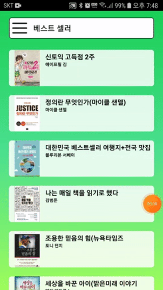
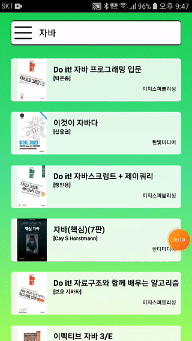

# KakaoBookAPI-MVVM-clean-Sample

## 애플리케이션 설명

- 카카오 검색 API를 이용한 책 검색 애플리케이션
- Clean Architecture를 구현한 샘플 애플리케이션

## 기술

- MVVM
- Clean Architecture
- Koin
- Retrofit2
- RxJava
- Room
- DataBinding

## 스크린샷

  

